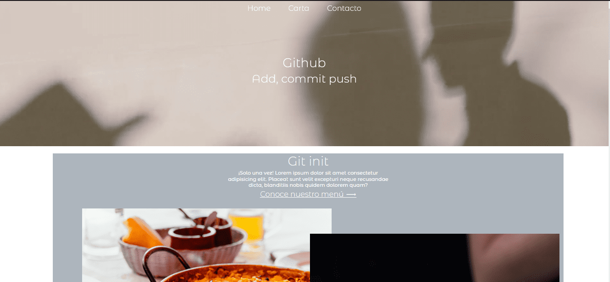
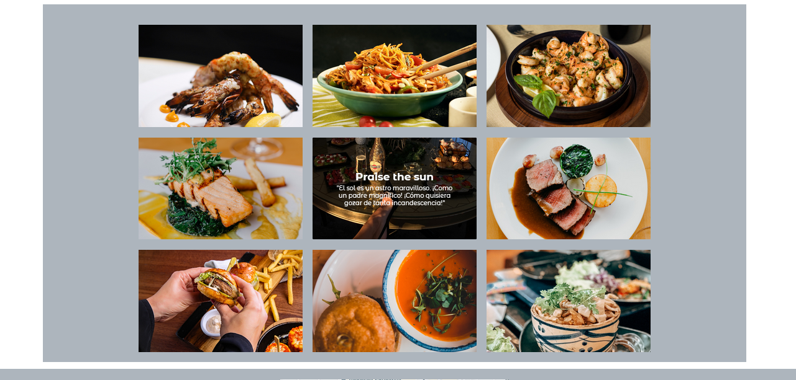
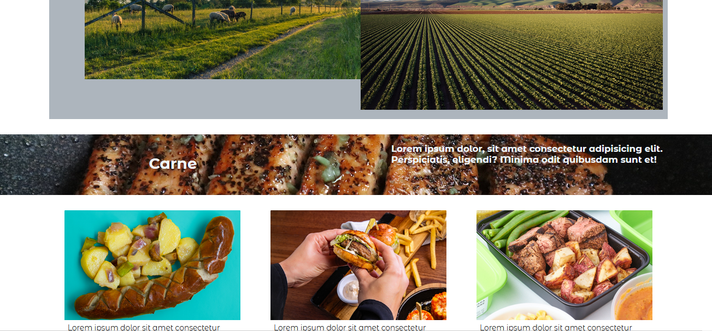
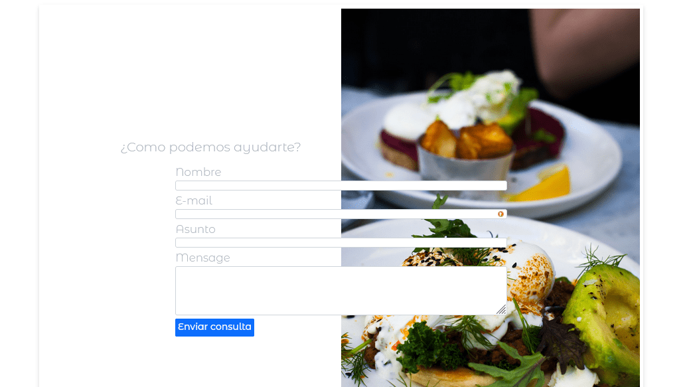

**Proyecto Bootstrap carta de restaurante**

Web de restaurante que contiene 3 páginas, home, carta y contacto.

Proyecto realizado usando Bootrap 5, CSS3 y HTML5 como parte del
bottcamp de Geekshub realizado en Urbalab, Gandía.

<https://iminguet.github.io/proyecto_restaurante/>

Todas las imágenes han sido extraidas debidamente de
<https://www.pexels.com/es-es/>

Ningún nombre ha sido cambiado en las imágenes para que se pueda
identificar al autor.
